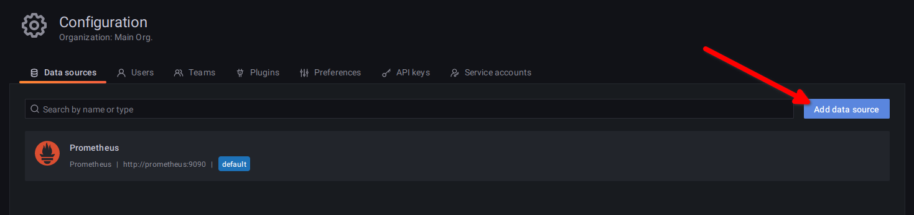

We have a PV system with a Fronius Symo Gen24 inverter, however you have to pay in order to have more than three days of history on Fronius Solar Web.

The Inverter does, however, have a publicly accessible JSON API, which has documentation available [here](https://www.fronius.com/~/downloads/Solar%20Energy/Operating%20Instructions/42,0410,2012.pdf). \
It can be accessed via `http://<inverter_ip>/solar_api/v1/GetPowerFlowRealtimeData.fcgi` and returns a JSON object with all the data (the `E_Day` and `E_Year` fields are exclusive to Fronius Non-Hybrid inverters starting from version 3.7.1-1 and Fronius Hybrid 1.3.1-1).

This guide is based on [this](https://panoptikum.m4r10k.io/fronius-gen24-prometheus-and-grafana-in-10-minutes-4fe403d10e2d) guide, but aims to go more into detail and provide a more complete setup.

## Docker Services

The data will be collected using [Prometheus](https://prometheus.io/) and the [JSON exporter](https://github.com/prometheus-community/json_exporter) and then visualized using [Grafana](https://grafana.com/).

### JSON exporter

The exporter functions in a really simple way, and the only thing we need to do, is to run it in a docker container and give it the correct config file.

**config.yml:**

```yaml
---
modules:
  default:    
    metrics:
    - name: battery
      type: object
      path: '{ .Body.Data.Inverters.1 }'
      help: Battery Data
      labels:
        id: "battery"
        name: "battery"
      values:
        SOC: '{.SOC}'

    - name: site
      type: object
      path: '{ .Body.Data.Site }'
      help: Site Data
      labels:
        id: "site"
        name: "site"
      values:
        P_Akku: '{.P_Akku}'
        P_Grid: '{.P_Grid}'
        P_Load: '{.P_Load}'
        P_PV: '{.P_PV}'
```

There are two ways this config file can be mounted into the container, either by using a volume or by mounting it directly.

#### 1. Mounting a volume and moving the config file into it

You might want to choose this option, if you don't want to have the config file lying around on your host machine (especially when using something like Portainer).

**docker-compose.yml:**

```yaml
version: '3'

volumes:
    json-config:

services:
    json-exporter:
        image: quay.io/prometheuscommunity/json-exporter
        restart: unless-stopped
        command: --config.file=/config/config.yml
        volumes:
            - json-config:/config 
```

In this case, you have to first create the container using the docker-compose file above and then copy the config file into it by running the following command:

```bash
docker cp config.yml <container_name>:/config/config.yml
```

#### 2. Mounting the config file directly (may not work when using Portainer to deploy from git)

This option is a bit more straightforward, but requires the config file to always be in the same location on the host file system. \
The only thing necessary here is to specify the path to the config file in the docker-compose file.

**docker-compose.yml:**

```yaml
version: '3'

volumes:
    json-config:

services:
    json-exporter:
        image: quay.io/prometheuscommunity/json-exporter
        restart: unless-stopped
        command: --config.file=/config.yml
        volumes:
            - ./config.yml:/config.yml
```

### Prometheus

Setting up Prometheus works similarly to above, but we **have** to mount a volume for persistent storage in order to keep our data when updating the container, so it makes sense to always go with the equivalent of option 1 from above.

**prometheus.yml:**

```yaml
scrape_configs:

  ## gather metrics of prometheus itself
- job_name: prometheus
  static_configs:
    - targets:
      - prometheus:9090

  ## gather the metrics of json_exporter application itself
- job_name: json_exporter
  static_configs:
    - targets:
      - json-exporter:7979 ## Location of the json exporter's real <hostname>:<port>

  ## gather the metrics from third party json sources, via the json exporter
- job_name: json
  scrape_interval: 5s
  metrics_path: /probe
  params:
    module: [default]
  static_configs:
    - targets:
      - http://<inverter_ip>/solar_api/v1/GetPowerFlowRealtimeData.fcgi
  relabel_configs:
    - source_labels: [__address__]
      target_label: __param_target
    - source_labels: [__param_target]
      target_label: instance
    - target_label: __address__
      replacement: json-exporter:7979 ## Location of the json exporter's real <hostname>:<port>
```

**docker-compose.yml:**

```yaml
version: '3'

volumes:
    prometheus:

services:
    image: prom/prometheus
    restart: unless-stopped
    ports:
        - '9090:9090'
    command:
        - --storage.tsdb.path=/prometheus
        - --storage.tsdb.retention.time=5y
        - --config.file=/promehteus/prometheus.yml
    volumes:
        - prometheus:/prometheus
```

We also have to expose port 9090 in order to access the Prometheus web interface.

The three entries in the `command` section specify the path where the data is stored, the retention time and the path to the config file.

Again, we have to move our config file into the container like above:

```bash000:3000
docker cp prometheus.yml <container_name>:/prometheus/prometheus.yml
```

### Grafana

**docker-compose.yml:**

```yaml
version: '3'

volumes:
    grafana:

services:
    grafana:
        image: grafana/grafana-oss
        restart: unless-stopped
        ports:
            - '3000:3000'
        volumes:
            - grafana:/var/lib/grafana
```

As you can see, we have to expose port 3000 in order to access the Grafana web interface and mount a volume to `/var/lib/grafana` in order to have persistent storage.

### Combining everything

**docker-compose.yml:**

```yaml
version: '3'
volumes:
  json-config:
  prometheus:
  grafana:

services:
  json-exporter:
    image: quay.io/prometheuscommunity/json-exporter
    restart: unless-stopped
    command: --config.file=/config/config.yml
    volumes:
      - json-config:/config

  prometheus:
    image: prom/prometheus
    restart: unless-stopped
    ports:
      - '9090:9090'
    command:
      - --storage.tsdb.path=/prometheus
      - --storage.tsdb.retention.time=5y
      - --config.file=/prometheus/prometheus.yml
    volumes:
      - prometheus:/prometheus
    
  grafana:
    image: grafana/grafana-oss
    restart: unless-stopped
    ports:
      - '3000:3000'
    volumes:
      - grafana:/var/lib/grafana
```

## Configuring Grafana

After starting the containers, you can access the Grafana web interface at `http://<host_ip>:3000` and log in with the default credentials `admin:admin` after which you will be prompted to change the password, so do that.

You will, however, still not see anything in Grafana, since there are a few more steps to take.

### Adding Prometheus as a data source

1. Click on the gear icon in the left sidebar and select `Data Sources`

2. Click on `Add data source` (as you can see, I already have Prometheus set up)

3. Select `Prometheus`

4. Enter the URL of the Prometheus server (in this case `http://prometheus:9090`, since we can access it via the hostname `prometheus` from within the docker network) and click `Save & Test`


5. If everything went well, you should see a green `Data source is working` message


### Creating a dashboard

You can of course now create your own dashboard from scratch, but the following steps will show you how to import a premade one that you can customize to your liking.

1. Hover over the Dashboards icon in the left sidebar and select `Import`

2. Paste the following JSON into the text box


```json
{
  "annotations": {
    "list": [
      {
        "builtIn": 1,
        "datasource": {
          "type": "datasource",
          "uid": "grafana"
        },
        "enable": true,
        "hide": true,
        "iconColor": "rgba(0, 211, 255, 1)",
        "name": "Annotations & Alerts",
        "target": {
          "limit": 100,
          "matchAny": false,
          "tags": [],
          "type": "dashboard"
        },
        "type": "dashboard"
      }
    ]
  },
  "editable": true,
  "fiscalYearStartMonth": 0,
  "graphTooltip": 0,
  "id": 1,
  "links": [],
  "liveNow": true,
  "panels": [
    {
      "collapsed": false,
      "datasource": {
        "type": "prometheus",
        "uid": "atlsm-I4z"
      },
      "gridPos": {
        "h": 1,
        "w": 24,
        "x": 0,
        "y": 0
      },
      "id": 12,
      "panels": [],
      "targets": [
        {
          "datasource": {
            "type": "prometheus",
            "uid": "atlsm-I4z"
          },
          "refId": "A"
        }
      ],
      "title": "Row title",
      "type": "row"
    },
    {
      "datasource": {},
      "fieldConfig": {
        "defaults": {
          "color": {
            "mode": "thresholds"
          },
          "mappings": [],
          "thresholds": {
            "mode": "absolute",
            "steps": [
              {
                "color": "green",
                "value": null
              },
              {
                "color": "red",
                "value": 80
              }
            ]
          }
        },
        "overrides": []
      },
      "gridPos": {
        "h": 8,
        "w": 5,
        "x": 0,
        "y": 1
      },
      "id": 6,
      "options": {
        "orientation": "auto",
        "reduceOptions": {
          "calcs": [
            "lastNotNull"
          ],
          "fields": "",
          "values": false
        },
        "showThresholdLabels": false,
        "showThresholdMarkers": true
      },
      "pluginVersion": "9.2.0",
      "targets": [
        {
          "datasource": {
            "type": "prometheus",
            "uid": "jnmDPlsnk"
          },
          "editorMode": "code",
          "exemplar": true,
          "expr": "abs(site_P_Grid)",
          "interval": "",
          "legendFormat": "",
          "range": true,
          "refId": "A"
        }
      ],
      "title": "To/From Grid",
      "type": "gauge"
    },
    {
      "datasource": {},
      "fieldConfig": {
        "defaults": {
          "color": {
            "mode": "thresholds"
          },
          "mappings": [],
          "max": 6000,
          "min": 0,
          "thresholds": {
            "mode": "absolute",
            "steps": [
              {
                "color": "green",
                "value": null
              }
            ]
          }
        },
        "overrides": []
      },
      "gridPos": {
        "h": 8,
        "w": 5,
        "x": 5,
        "y": 1
      },
      "id": 8,
      "options": {
        "orientation": "auto",
        "reduceOptions": {
          "calcs": [
            "lastNotNull"
          ],
          "fields": "",
          "values": false
        },
        "showThresholdLabels": false,
        "showThresholdMarkers": true
      },
      "pluginVersion": "9.2.0",
      "targets": [
        {
          "datasource": {
            "type": "prometheus",
            "uid": "jnmDPlsnk"
          },
          "editorMode": "code",
          "exemplar": true,
          "expr": "abs(site_P_PV)",
          "interval": "",
          "legendFormat": "",
          "range": true,
          "refId": "A"
        }
      ],
      "title": "Production",
      "type": "gauge"
    },
    {
      "datasource": {},
      "fieldConfig": {
        "defaults": {
          "color": {
            "mode": "thresholds"
          },
          "mappings": [],
          "thresholds": {
            "mode": "absolute",
            "steps": [
              {
                "color": "orange",
                "value": null
              },
              {
                "color": "green",
                "value": 200
              },
              {
                "color": "#6ED0E0",
                "value": 300
              },
              {
                "color": "#EF843C",
                "value": 400
              }
            ]
          }
        },
        "overrides": []
      },
      "gridPos": {
        "h": 8,
        "w": 4,
        "x": 10,
        "y": 1
      },
      "id": 10,
      "options": {
        "orientation": "auto",
        "reduceOptions": {
          "calcs": [
            "lastNotNull"
          ],
          "fields": "",
          "values": false
        },
        "showThresholdLabels": false,
        "showThresholdMarkers": true
      },
      "pluginVersion": "9.2.0",
      "targets": [
        {
          "datasource": {
            "type": "prometheus",
            "uid": "jnmDPlsnk"
          },
          "editorMode": "code",
          "exemplar": true,
          "expr": "abs(site_P_Load)",
          "interval": "",
          "legendFormat": "",
          "range": true,
          "refId": "A"
        }
      ],
      "title": "Consumption",
      "type": "gauge"
    },
    {
      "datasource": {},
      "fieldConfig": {
        "defaults": {
          "color": {
            "mode": "continuous-GrYlRd"
          },
          "mappings": [],
          "max": 5000,
          "min": -5000,
          "thresholds": {
            "mode": "absolute",
            "steps": [
              {
                "color": "green",
                "value": null
              }
            ]
          }
        },
        "overrides": []
      },
      "gridPos": {
        "h": 8,
        "w": 4,
        "x": 14,
        "y": 1
      },
      "id": 16,
      "options": {
        "orientation": "auto",
        "reduceOptions": {
          "calcs": [
            "lastNotNull"
          ],
          "fields": "",
          "values": false
        },
        "showThresholdLabels": true,
        "showThresholdMarkers": true
      },
      "pluginVersion": "9.2.0",
      "targets": [
        {
          "datasource": {
            "type": "prometheus",
            "uid": "jnmDPlsnk"
          },
          "editorMode": "code",
          "exemplar": true,
          "expr": "site_P_Akku",
          "interval": "",
          "legendFormat": "",
          "range": true,
          "refId": "A"
        }
      ],
      "title": "Battery Discharge/Charge",
      "type": "gauge"
    },
    {
      "datasource": {},
      "fieldConfig": {
        "defaults": {
          "color": {
            "mode": "thresholds"
          },
          "mappings": [],
          "max": 100,
          "min": 0,
          "thresholds": {
            "mode": "absolute",
            "steps": [
              {
                "color": "red",
                "value": null
              },
              {
                "color": "orange",
                "value": 20
              },
              {
                "color": "#EAB839",
                "value": 50
              },
              {
                "color": "green",
                "value": 80
              }
            ]
          }
        },
        "overrides": []
      },
      "gridPos": {
        "h": 8,
        "w": 6,
        "x": 18,
        "y": 1
      },
      "id": 14,
      "options": {
        "orientation": "auto",
        "reduceOptions": {
          "calcs": [
            "lastNotNull"
          ],
          "fields": "",
          "values": false
        },
        "showThresholdLabels": false,
        "showThresholdMarkers": true
      },
      "pluginVersion": "9.2.0",
      "targets": [
        {
          "datasource": {
            "type": "prometheus",
            "uid": "jnmDPlsnk"
          },
          "editorMode": "code",
          "exemplar": true,
          "expr": "battery_SOC",
          "interval": "",
          "legendFormat": "",
          "range": true,
          "refId": "A"
        }
      ],
      "title": "Battery State of Charge",
      "type": "gauge"
    },
    {
      "datasource": {
        "type": "prometheus",
        "uid": "atlsm-I4z"
      },
      "fieldConfig": {
        "defaults": {
          "color": {
            "mode": "palette-classic"
          },
          "custom": {
            "axisCenteredZero": false,
            "axisColorMode": "text",
            "axisLabel": "",
            "axisPlacement": "left",
            "barAlignment": 0,
            "drawStyle": "line",
            "fillOpacity": 0,
            "gradientMode": "none",
            "hideFrom": {
              "legend": false,
              "tooltip": false,
              "viz": false
            },
            "lineInterpolation": "linear",
            "lineWidth": 1,
            "pointSize": 5,
            "scaleDistribution": {
              "type": "linear"
            },
            "showPoints": "auto",
            "spanNulls": false,
            "stacking": {
              "group": "A",
              "mode": "none"
            },
            "thresholdsStyle": {
              "mode": "off"
            }
          },
          "mappings": [],
          "thresholds": {
            "mode": "absolute",
            "steps": [
              {
                "color": "green",
                "value": null
              },
              {
                "color": "red",
                "value": 80
              }
            ]
          },
          "unit": "watt"
        },
        "overrides": [
          {
            "matcher": {
              "id": "byName",
              "options": "Production"
            },
            "properties": [
              {
                "id": "color",
                "value": {
                  "fixedColor": "semi-dark-orange",
                  "mode": "fixed"
                }
              }
            ]
          },
          {
            "matcher": {
              "id": "byName",
              "options": "Power from Grid"
            },
            "properties": [
              {
                "id": "color",
                "value": {
                  "fixedColor": "#b7b7b7",
                  "mode": "fixed"
                }
              }
            ]
          },
          {
            "matcher": {
              "id": "byName",
              "options": "Consumption"
            },
            "properties": [
              {
                "id": "color",
                "value": {
                  "fixedColor": "dark-blue",
                  "mode": "fixed"
                }
              }
            ]
          },
          {
            "matcher": {
              "id": "byName",
              "options": "SoC"
            },
            "properties": [
              {
                "id": "color",
                "value": {
                  "fixedColor": "dark-green",
                  "mode": "fixed"
                }
              },
              {
                "id": "unit",
                "value": "percent"
              },
              {
                "id": "custom.axisPlacement",
                "value": "right"
              },
              {
                "id": "custom.axisSoftMax",
                "value": 100
              },
              {
                "id": "custom.axisSoftMin",
                "value": 0
              }
            ]
          }
        ]
      },
      "gridPos": {
        "h": 15,
        "w": 24,
        "x": 0,
        "y": 9
      },
      "id": 2,
      "options": {
        "legend": {
          "calcs": [],
          "displayMode": "list",
          "placement": "bottom",
          "showLegend": true
        },
        "tooltip": {
          "mode": "multi",
          "sort": "none"
        }
      },
      "targets": [
        {
          "datasource": {
            "type": "prometheus",
            "uid": "atlsm-I4z"
          },
          "editorMode": "code",
          "expr": "abs(battery_SOC)",
          "hide": false,
          "legendFormat": "SoC",
          "range": true,
          "refId": "battery_SOC"
        },
        {
          "datasource": {
            "type": "prometheus",
            "uid": "jnmDPlsnk"
          },
          "editorMode": "code",
          "exemplar": true,
          "expr": "abs(site_P_PV{})",
          "interval": "",
          "legendFormat": "Production",
          "range": true,
          "refId": "P_PV"
        },
        {
          "datasource": {
            "type": "prometheus",
            "uid": "jnmDPlsnk"
          },
          "editorMode": "code",
          "exemplar": true,
          "expr": "abs(site_P_Grid)",
          "hide": false,
          "interval": "",
          "legendFormat": "Power to Grid",
          "range": true,
          "refId": "P_Grid"
        },
        {
          "datasource": {
            "type": "prometheus",
            "uid": "jnmDPlsnk"
          },
          "editorMode": "code",
          "exemplar": true,
          "expr": "abs(site_P_Load)",
          "hide": false,
          "interval": "",
          "legendFormat": "Consumption",
          "range": true,
          "refId": "P_Load"
        }
      ],
      "title": "PV Overview",
      "type": "timeseries"
    }
  ],
  "refresh": "5s",
  "schemaVersion": 37,
  "style": "dark",
  "tags": [],
  "templating": {
    "list": []
  },
  "time": {
    "from": "now-6h",
    "to": "now"
  },
  "timepicker": {},
  "timezone": "",
  "title": "Fronius",
  "uid": "VXvFPls7k",
  "version": 12,
  "weekStart": ""
}
```


3. Click on `Load` and then `Import` (you can name it whatever you want)


From here you can edit the dashboard however much you want, the possibilities in Grafana are pretty much endless.

One bug I encountered was, that none of the Panels were showing any values. I fixed this by simply going into the edit mode for every single one of them (hover over and press `e`), clicking inside the query field and then clicking on the empty space below.

If you have any questions, suggestions, or I missed something, please let me know via the `Suggest Changes` link below the heading.
